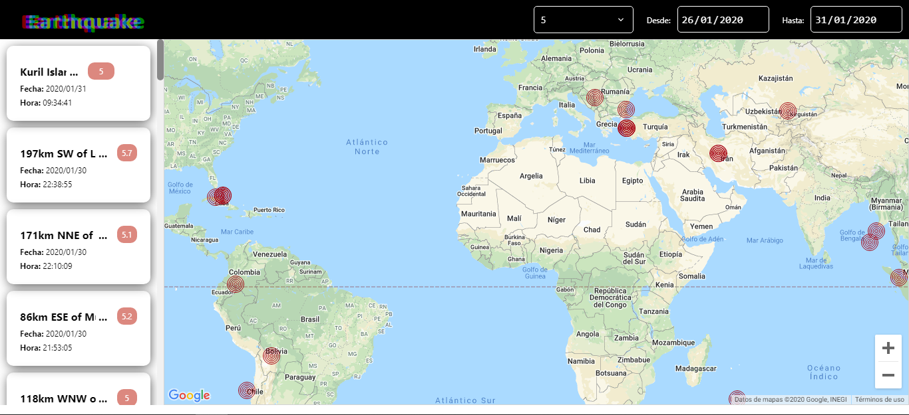

# Earthquake - React JS

Este proyecto muestra los sismos sucedidos durante un rango de tiempo. Se puede filtrar por fechas y por magnitud. 
Los resultados obtenidos, son plasmados con Google Maps.

Deployed => https://matthewgz.github.io/Earthquake/

## Prerequisites
Si tienes una key API para Google Maps, puedes crear un archivo ".env" a la altura del "package.json". El contenido del archivo ".env" debe ser el siguiente:

`REACT_APP_MAPS_KEY="INSERT_HERE_YOUR_API_KEY"`

Si no tienes una key, de todas formas puedes desplegar el proyecto, pero este mostrara el google maps en modo desarrollo.

## Install Dependencies
`$ npm install`

## Run mode Debug
`$ npm run build:dev`

## Build DLL's
`$ npm run build:dll`

## Build Mode Production
`$ npm run build`
