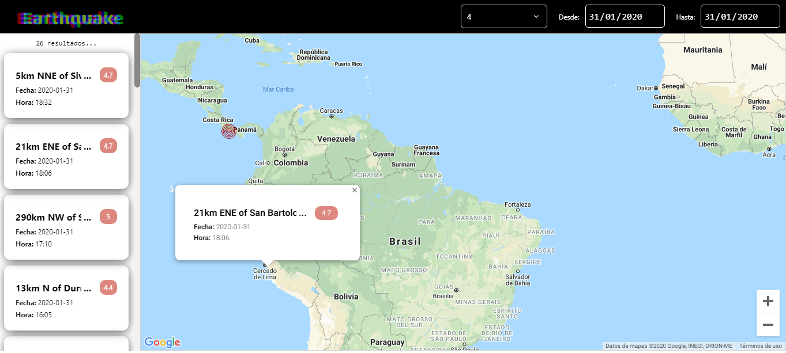

# Earthquake - React JS

Este proyecto muestra los sismos sucedidos durante un rango de tiempo. Se puede filtrar por fechas y por magnitud. 
Los resultados obtenidos, son plasmados con Google Maps.

